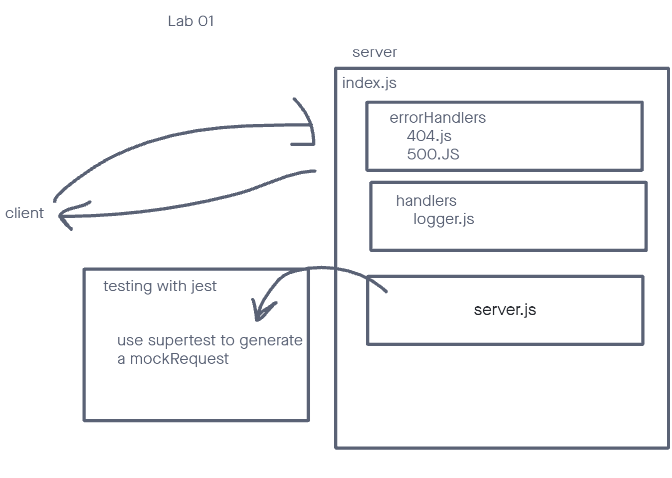

# LAB - Class 01

## Project: server-deployment-practice

### Author: Marco Villafana

### Problem Domain

Basic API Server where we write some middleware and practice deployment

### Links and Resources

- [GitHub Actions ci/cd](https://github.com/villafanam/server-deployment-practice/actions)
- [back-end server url](https://server-deployment-practice-no0j.onrender.com)

### Setup

#### `.env` requirements (where applicable)

for now I have none and do not require one

#### How to initialize/run your application (where applicable)

- e.g. `npm start`

#### How to use your library (where applicable)

#### Features / Routes

- Feature One: Deploy main

#### Tests

- `npm test` in terminal to start tests
- path tests
  - handle the root path
  - handle invalid requests
  - handle errors

#### UML

